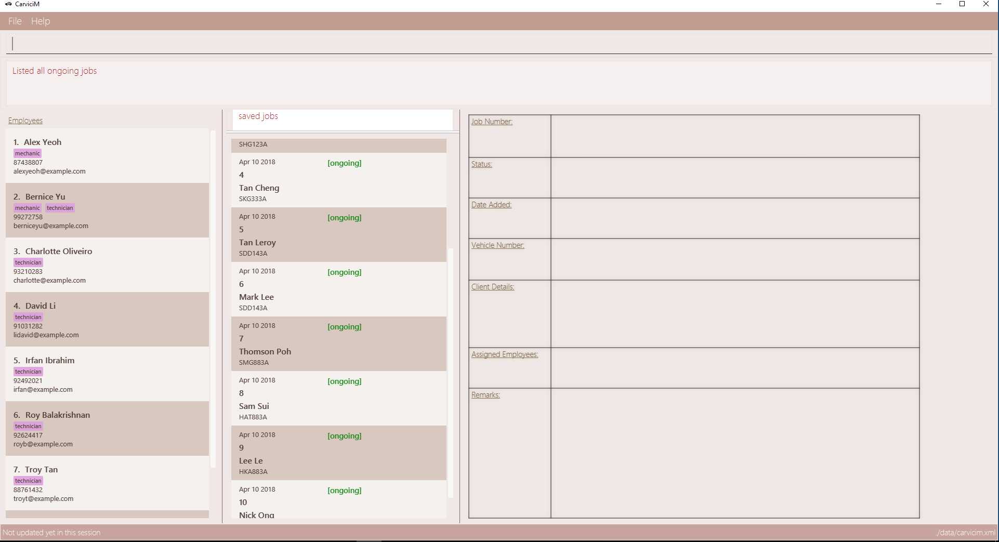

= CarviciM
ifdef::env-github,env-browser[:relfileprefix: docs/]

https://travis-ci.org/CS2103JAN2018-W09-B1/main[image:https://travis-ci.org/CS2103JAN2018-W09-B1/main.svg?branch=master[Build Status]]
image:https://coveralls.io/repos/github/CS2103JAN2018-W09-B1/main/badge.svg?branch=master[""Coverage Status", link ="https://coveralls.io/github/CS2103JAN2018-W09-B1/main"]

CarviciM is your go-to desktop application for managing car servicing jobs. If you prefer to perform your tasks with minimal usage of the mouse, this is the application just for you!

ifdef::env-github[]

endif::[]

ifndef::env-github[]
image::images/Ui.png[width="600"]
endif::[]

* This application has a GUI but most of the user interactions happen using a CLI (Command Line Interface).
* This application aims to helps users who are proficient at using the keyboard to manage their car servicing jobs swiftly. As such, most of the available commands can be executed using just the keyboard.

== Site Map

* <<UserGuide#, User Guide>>
* <<DeveloperGuide#, Developer Guide>>
* <<AboutUs#, About Us>>
* <<ContactUs#, Contact Us>>

== Acknowledgements
* CarviciM is built on a fork of https://github.com/nus-cs2103-AY1718S2/addressbook-level4[AddressBook - Level 4], which was developed by the https://se-edu.github.io/docs/Team.html[se-edu] team. +
* Some parts of this sample application were inspired by the excellent http://code.makery.ch/library/javafx-8-tutorial/[Java FX tutorial] by
_Marco Jakob_.
* Libraries used: https://github.com/TomasMikula/EasyBind[EasyBind], https://github.com/TestFX/TestFX[TextFX], https://bitbucket.org/controlsfx/controlsfx/[ControlsFX], https://github.com/FasterXML/jackson[Jackson], https://github.com/google/guava[Guava], https://github.com/junit-team/junit4[JUnit4]

== Licence : link:LICENSE[MIT]
